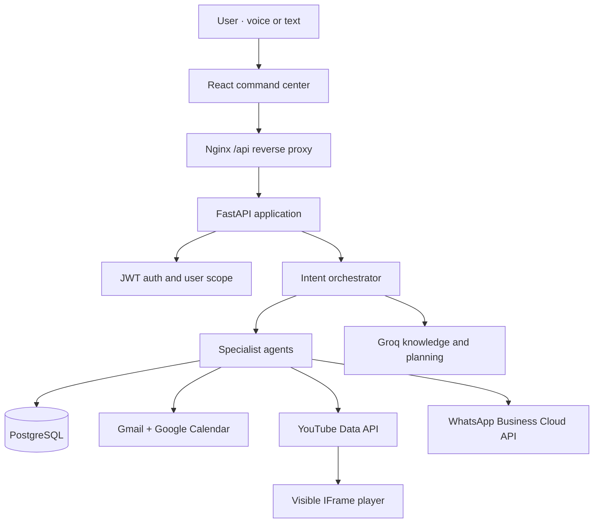
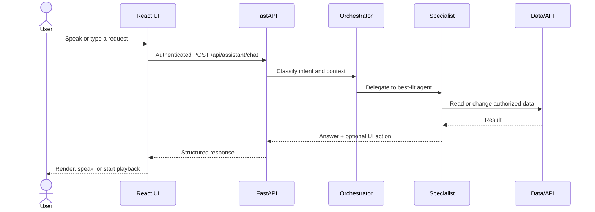
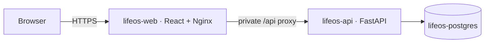
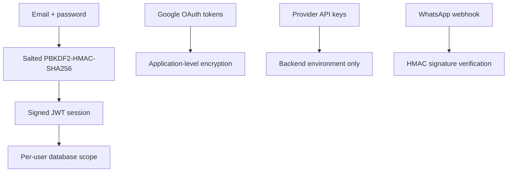

<div align="center">

# ✦ LifeOS

### Your life. One intelligence.

**A voice-first, multi-agent personal AI operating system that turns natural language into useful action.**

[](https://fastapi.tiangolo.com/)
[](https://react.dev/)
[](https://www.postgresql.org/)
[](https://groq.com/)
[](https://render.com/)

[Live App](https://lifeos-web-jomn.onrender.com) · [API Health](https://lifeos-api-eh4l.onrender.com/health) · [Architecture](#-system-architecture) · [Deploy](#-deploy-to-render) · [Demo Video](https://drive.google.com/file/d/1sJgZ24y1zy55BQF8AEzyY-s0p-lQHu8a/view?usp=sharing)
<br />

> **Think less about managing. Live more.**  
> LifeOS brings tasks, goals, calendar, finances, memory, Gmail, voice, AI reasoning, and music into one beautifully focused command center.

</div>

---

## The idea

Your digital life is fragmented across apps. Email knows what people need from you. Calendar knows where your time goes. Task managers know what remains unfinished. Finance tools know what you spent. None of them understands the whole picture.

**LifeOS is the intelligence layer above those tools.** You speak or type one request; a lightweight orchestrator identifies the intent, selects a specialist agent, uses the right data source, performs the action, and returns one clear answer.

```text
“Plan my day around my meetings and highest-priority tasks.”
“Remember that my interview is Friday.”
“I spent ₹250 on lunch.”
“Summarize my inbox.”
“Play Arijit Singh songs.”
“Explain quantum computing simply.”
```

## Why LifeOS stands out

| Capability | What it delivers |
| --- | --- |
| **Voice-first interaction** | Browser speech recognition for input and natural spoken responses through speech synthesis |
| **Multi-agent execution** | Deterministic routing across tasks, goals, planning, calendar, finance, memory, mail, music, and general knowledge |
| **Real personal context** | Persistent, user-scoped data stored in PostgreSQL instead of disposable chat history |
| **Useful AI, not only chat** | Commands create records, update state, search authorized services, or control playback |
| **Official integrations** | Gmail and Calendar via Google OAuth; music via YouTube Data API + IFrame Player |
| **Production-shaped delivery** | Dockerized FastAPI and React services, Nginx reverse proxy, managed PostgreSQL, and a Render Blueprint |
| **Privacy-conscious design** | JWT authentication, password hashing, encrypted OAuth tokens, signed OAuth state, and server-side secrets |

## Feature map

| Module | Examples | Status |
| --- | --- | :---: |
| **AI Assistant** | Ask general questions, route commands, generate context-aware plans | ✅ |
| **Voice** | Speak commands, receive spoken answers, replay assistant messages | ✅ |
| **Tasks** | Create, prioritize, complete, and track due dates | ✅ |
| **Goals** | Create goals and monitor progress | ✅ |
| **Planner** | Build a time-blocked day from tasks, goals, and calendar context | ✅ |
| **Calendar** | Manage LifeOS events and import upcoming Google Calendar events | ✅ |
| **Finance** | Record income/expenses and view personal totals | ✅ |
| **Memory** | Store and search useful personal facts | ✅ |
| **Gmail** | Read recent authorized messages and generate inbox summaries | ✅ |
| **YouTube Music** | Official search, visible embedded playback, queue, pause, resume, stop, next | ✅ |
| **WhatsApp Business** | Receive authorized Business Cloud API messages through verified webhooks | Optional |
| **Scheduled push alerts** | Background reminder delivery through notifications/email/SMS | Roadmap |

> [!IMPORTANT]
> Music uses the **official YouTube Data API v3 and YouTube IFrame Player API**. LifeOS does not use `yt-dlp`, extract streams, hide playback, or download media.

## 🧠 System architecture



### Request lifecycle



### Agent topology

| Agent | Responsibility | Typical output |
| --- | --- | --- |
| **Orchestrator** | Detects intent and selects the execution path | Agent route + structured request |
| **Knowledge agent** | Answers open-ended questions through Groq | Natural-language answer |
| **Planner agent** | Synthesizes tasks, goals, and schedule | Adaptive time-blocked plan |
| **Task agent** | Creates, updates, lists, and completes tasks | Persistent task mutation |
| **Goal agent** | Tracks longer-term outcomes | Goal record or progress update |
| **Calendar agent** | Handles LifeOS events and Google imports | Event or schedule result |
| **Finance agent** | Records income and expenses | Ledger entry and summary |
| **Memory agent** | Saves and retrieves personal context | User-scoped memory |
| **Mail agent** | Reads authorized Gmail metadata/content | Inbox summary |
| **Music agent** | Searches official YouTube results and emits controls | Search action + playable queue |

The orchestrator keeps structured commands predictable while using the LLM where language reasoning adds value. This hybrid design reduces unnecessary model calls and makes state-changing actions easier to test.

## Technology stack

| Layer | Technology | Purpose |
| --- | --- | --- |
| Frontend | React, Vite, Lucide, browser Web Speech APIs | Responsive command center, voice, spoken output |
| Edge | Nginx | Static delivery, SPA routing, `/api` reverse proxy, health endpoint |
| Backend | FastAPI, Pydantic, SQLAlchemy | Typed APIs, orchestration, business logic |
| Database | PostgreSQL on Render; SQLite for simple local use | Durable user-scoped state |
| AI | Groq OpenAI-compatible API | General knowledge, summaries, enhanced planning |
| Google | OAuth 2.0, Gmail API, Calendar API | Authorized inbox and schedule access |
| Music | YouTube Data API v3, IFrame Player API | Compliant discovery and playback |
| Deployment | Docker, Docker Compose, Render Blueprint | Reproducible local and cloud environments |

## Repository anatomy

```text
LifeOS/
├── backend/
│   ├── app/
│   │   ├── routers/          # auth, assistant, CRUD, music, integrations
│   │   ├── services/         # agent router, LLM, Google, YouTube
│   │   ├── models.py         # SQLAlchemy entities
│   │   ├── schemas.py        # API contracts
│   │   ├── security.py       # JWT, hashing, token encryption
│   │   └── main.py           # FastAPI composition and health check
│   ├── tests/                # backend behavior and API tests
│   ├── Dockerfile
│   └── requirements.txt
├── frontend/
│   ├── src/
│   │   ├── components/       # layout, voice control, music dock
│   │   ├── pages/            # assistant and LifeOS modules
│   │   └── api.js            # authenticated API client
│   ├── docker/               # Render-ready Nginx templates
│   ├── Dockerfile
│   └── package.json
├── docker-compose.yml        # complete local stack
└── render.yaml               # API + web + PostgreSQL Blueprint
```

## Quick start

### Prerequisites

- Docker Desktop with Docker Compose
- A [Groq API key](https://console.groq.com/keys)
- A Google Cloud API key with **YouTube Data API v3** enabled
- Optional Google OAuth credentials for Gmail and Calendar

### 1. Configure the backend

```bash
cp backend/.env.example backend/.env
```

Windows PowerShell:

```powershell
Copy-Item backend\.env.example backend\.env
```

Add the minimum required values to `backend/.env`:

```env
LLM_API_KEY=your_groq_api_key
LLM_BASE_URL=https://api.groq.com/openai/v1
LLM_MODEL=groq/compound

YOUTUBE_API_KEY=your_youtube_data_api_key
YOUTUBE_REGION=IN
```

### 2. Start the complete stack

```bash
docker compose up --build
```

| Service | Local URL |
| --- | --- |
| LifeOS | <http://localhost:5173> |
| FastAPI docs | <http://localhost:8000/docs> |
| Backend health | <http://localhost:8000/health> |

### Run without Docker

Backend:

```bash
cd backend
python -m venv .venv
source .venv/bin/activate   # Windows: .venv\Scripts\activate
pip install -r requirements.txt
uvicorn app.main:app --reload --port 8000
```

Frontend, in a second terminal:

```bash
cd frontend
npm install
npm run dev
```

Vite proxies `/api` to `http://localhost:8000` during local development.

## Configuration reference

### Backend environment variables

| Variable | Required | Description |
| --- | :---: | --- |
| `DATABASE_URL` | Production | PostgreSQL connection string; supplied by the Render database |
| `ENVIRONMENT` | Yes | Use `production` on Render |
| `ALLOWED_ORIGINS` | Yes | Allowed browser origins; use the exact frontend origin for a public launch |
| `SECRET_KEY` | Yes | Strong random key used for signed authentication data |
| `APP_ENCRYPTION_KEY` | Yes | Strong random key used to protect stored integration tokens |
| `LLM_API_KEY` | AI | Groq API key |
| `LLM_BASE_URL` | AI | `https://api.groq.com/openai/v1` |
| `LLM_MODEL` | AI | A model available to your Groq account; `groq/compound` is the recommended project default |
| `YOUTUBE_API_KEY` | Music | YouTube Data API v3 key |
| `YOUTUBE_REGION` | No | Regional search preference, for example `IN` |
| `GOOGLE_CLIENT_ID` | Google | OAuth web-client ID |
| `GOOGLE_CLIENT_SECRET` | Google | OAuth web-client secret |
| `GOOGLE_REDIRECT_URI` | No | Keep blank to derive the callback from the public proxied request |
| `WHATSAPP_VERIFY_TOKEN` | WhatsApp | Private webhook verification value you choose |
| `WHATSAPP_APP_SECRET` | WhatsApp | Meta app secret used for signature verification |

> [!CAUTION]
> Never commit `.env`, API keys, OAuth secrets, access tokens, or generated production secrets. If a key is ever visible in a screenshot, issue, commit, or chat, rotate it immediately.

## Connect Google Workspace

LifeOS requests only the scopes needed by the implemented Gmail and Calendar features.

1. Open [Google Cloud Console](https://console.cloud.google.com/).
2. Enable **Gmail API** and **Google Calendar API**.
3. Configure the OAuth consent screen.
4. While the app remains in **Testing**, add every allowed Google account under **Test users**.
5. Create an OAuth client with application type **Web application**.
6. Add the exact callback URI:

```text
Local:  http://localhost:5173/api/integrations/google/callback
Render: https://YOUR-LIFEOS-WEB.onrender.com/api/integrations/google/callback
```

7. Set `GOOGLE_CLIENT_ID` and `GOOGLE_CLIENT_SECRET` on the backend, rebuild, and deploy.
8. In LifeOS, open **Integrations → Google Workspace → Connect**.

If Google shows `redirect_uri_mismatch`, the authorized URI and the URI sent by LifeOS are not identical. Scheme, hostname, path, port, and trailing slash all matter. If Google shows `access_denied` while the consent screen is in Testing, add the signed-in address as a test user.

### Current Google behavior

- Gmail access is read-only and used for recent-message summaries.
- Calendar sync imports upcoming Google events into LifeOS.
- Creating a LifeOS event does not yet push it back to Google Calendar.
- OAuth tokens are encrypted before database storage.

## Enable YouTube playback

1. In Google Cloud, enable **YouTube Data API v3**.
2. Create an API key.
3. Restrict its API scope to **YouTube Data API v3**.
4. Add it to the **backend** service as `YOUTUBE_API_KEY`.
5. Save, rebuild, deploy, and try `Play Alan Walker Faded`.

The backend performs official search and returns video IDs plus public metadata. The frontend passes those IDs to the official visible IFrame player. Browser autoplay policy may require one user click before audio begins.

## Optional WhatsApp Business integration

LifeOS supports the Meta-sanctioned **WhatsApp Business Cloud API** webhook model. It does not scrape personal WhatsApp history.

```env
WHATSAPP_VERIFY_TOKEN=a_long_random_value_you_choose
WHATSAPP_APP_SECRET=your_meta_app_secret
```

Configure Meta with:

```text
Callback URL: https://YOUR-LIFEOS-WEB.onrender.com/api/integrations/whatsapp/webhook
Verify token:  exactly the value of WHATSAPP_VERIFY_TOKEN
Field:         messages
```

Then connect the Business **Phone number ID** and permanent system-user access token from LifeOS → Integrations. WhatsApp is optional; every other LifeOS module can run without it.

## 🚀 Deploy to Render

The root `render.yaml` provisions the entire cloud topology:



### Deployment steps

1. Push the project to GitHub with `render.yaml` at the repository root.
2. In Render, choose **New → Blueprint** and connect the repository.
3. Enter all `sync: false` secrets requested during creation.
4. Apply the Blueprint and wait for all three resources to become healthy.
5. Open the public `lifeos-web` URL—not the private backend hostname.
6. Add the final frontend OAuth callback to Google Cloud.
7. Test `/health`, create an account, and run the smoke-test checklist below.

The frontend does not need a hard-coded public API address. Nginx forwards `/api/*` to FastAPI across Render's private network using the `BACKEND_HOST` and `BACKEND_PORT` values injected by the Blueprint.

### Render secrets checklist

| Service | Variables |
| --- | --- |
| `lifeos-api` | `LLM_API_KEY`, `YOUTUBE_API_KEY`, optional Google and WhatsApp secrets |
| `lifeos-web` | `BACKEND_HOST`, `BACKEND_PORT` supplied from the API service |
| Database | `DATABASE_URL` supplied automatically to the API service |

Render free instances can sleep after inactivity, so the first request may take noticeably longer while the backend wakes.

## Validation and quality gates

### Automated checks

```bash
# Backend
cd backend
pytest -q

# Frontend
cd frontend
npm install
npm run build
```

### Production smoke test

| Test | Command or action | Expected result |
| --- | --- | --- |
| Health | Open `/health` on both services | HTTP `200` |
| Authentication | Register, sign out, sign back in | Session restores correctly |
| General AI | `Explain machine learning simply` | Groq-generated answer |
| Task agent | `Add task to revise DSA tomorrow at 7 PM` | Task appears with due date |
| Goal agent | `Set a goal to finish my portfolio by Friday` | Goal appears in Goals |
| Planner | `Plan my day` | Context-aware time blocks |
| Finance | `I spent 250 on lunch` | Expense appears in Finance |
| Memory | `Remember my interview is Friday` | Memory is stored and searchable |
| Music | `Play Arijit Singh songs` | Search result and embedded queue appear |
| Voice | Allow microphone, speak a command | Transcript is sent; answer can be spoken |
| Gmail | Connect Google, then summarize inbox | Recent authorized mail is summarized |
| Calendar | Connect Google, then sync calendar | Upcoming events appear in LifeOS |

For API-level investigation, use FastAPI's interactive OpenAPI page at `/docs` and inspect the backend logs on Render. A `401` normally indicates an expired/missing JWT; `403` usually points to OAuth consent or permissions; `404` from the frontend proxy usually means an incorrect route or upstream configuration; `429` indicates provider quota or rate limits.

## Security model



- Passwords are salted and hashed; plaintext passwords are never stored.
- Protected API routes require signed bearer tokens.
- User records are scoped to the authenticated user.
- Google and WhatsApp credentials are encrypted at rest.
- Google OAuth state is signed and short-lived.
- Provider API keys remain server-side.
- WhatsApp request bodies are verified with `X-Hub-Signature-256` when the app secret is configured.

### Before a public multi-user launch

- Replace wildcard CORS with the exact frontend origin.
- Add request rate limiting, abuse controls, and structured audit logs.
- Introduce managed database migrations and encrypted backups.
- Complete Google's OAuth verification for sensitive/restricted scopes.
- Complete Meta review if WhatsApp is enabled for production users.
- Add a privacy policy, terms, data deletion flow, and account export.
- Rotate secrets on a schedule and after any accidental exposure.

## Honest platform boundaries

- **Reminders are stored as due tasks/events today; they do not yet trigger background push notifications.** Keep the app open to view them, or add a worker plus Web Push/email/SMS delivery.
- Gmail is read-only.
- Google Calendar currently imports events; it is not yet a two-way sync.
- WhatsApp support is limited to messages authorized through a Business Cloud API number.
- Browser speech recognition support varies; Chrome and Edge are the most reliable targets.
- The browser controls autoplay. A visible click may be required before YouTube audio starts.
- Search and AI features depend on third-party quota, account access, and current model availability.
- Render free services may cold-start after inactivity.

## Roadmap

- [ ] Background reminder worker with Web Push and email delivery
- [ ] Two-way Google Calendar event sync
- [ ] Streaming assistant responses and interruptible voice playback
- [ ] Retrieval-augmented personal memory with semantic search
- [ ] Recurring tasks, routines, and habit intelligence
- [ ] Fine-grained integration permissions and data-retention controls
- [ ] Observability dashboard, rate limits, and migration pipeline
- [ ] Installable PWA with offline-first task capture

## Example command gallery

```text
Knowledge     → “Explain transformers like I’m a beginner.”
Planning      → “Plan my day around my meetings and urgent tasks.”
Tasks         → “Add a high-priority task to submit the report at 8 PM.”
Goals         → “Set a goal to complete the ML course by next month.”
Calendar      → “Schedule project review tomorrow at 4 PM.”
Finance       → “I spent ₹650 on groceries.”
Memory        → “Remember that I prefer morning study sessions.”
Gmail         → “Summarize my recent inbox.”
Music         → “Play focus music.”
Control       → “Pause music.” · “Resume music.” · “Next song.”
```

## Engineering principles

1. **Action over novelty** — AI should change useful state, not merely produce text.
2. **Determinism where it matters** — structured commands follow explicit, testable paths.
3. **Least privilege** — every integration receives only the access its feature requires.
4. **Official APIs** — provider rules and user trust take priority over shortcuts.
5. **Visible limitations** — the interface and documentation distinguish working features from roadmap items.
6. **Deployability by default** — local development and cloud production share containerized boundaries.

## Contributing

1. Fork the repository and create a focused feature branch.
2. Keep secrets out of commits and test fixtures.
3. Add or update tests for every behavior change.
4. Run backend tests and the frontend production build.
5. Open a pull request explaining the user impact, implementation, and verification.

---

<div align="center">

### Built to make personal computing feel personal again.

**LifeOS** · voice-first · multi-agent · privacy-conscious · action-oriented

If this project inspires you, consider starring the repository and building the next agent.

</div>
