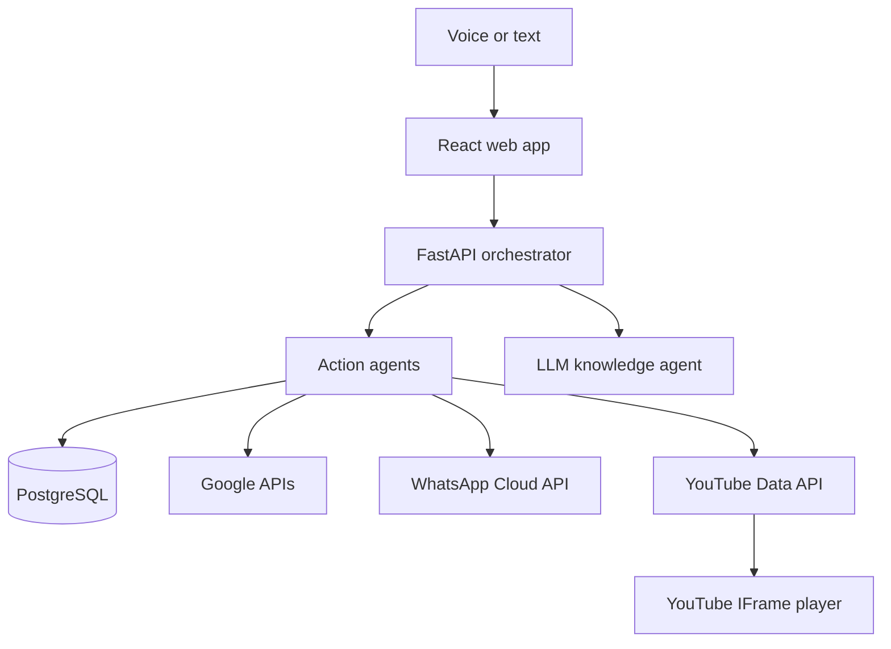

# LifeOS — Personal AI Operating System

LifeOS is a production-shaped, voice-first personal assistant built with FastAPI, React, PostgreSQL, and a small multi-agent orchestration layer. It can answer general questions through an LLM, turn natural-language commands into actions, plan a day from personal context, manage tasks/goals/calendar/finance/memory, summarize Gmail, sync Google Calendar, receive authorized WhatsApp Business messages, and control official YouTube playback.

> Music is implemented with **YouTube Data API v3 + YouTube IFrame Player API**. This project does not contain or use `yt-dlp`, stream extraction, or media downloading.

## What works

- Voice input using the browser Speech Recognition API (Chrome/Edge recommended)
- Spoken answers using browser speech synthesis
- General question answering through Groq or another OpenAI-compatible chat API
- Deterministic specialist agents for tasks, goals, memories, finance, calendar, music, mail, and planning
- JWT login with PBKDF2 password hashing
- Tasks, goals, daily calendar, expenses/income, and searchable personal memory
- Gmail recent-message summaries through Google OAuth
- Google Calendar sync through Google OAuth
- WhatsApp Business Cloud webhook ingestion with signature verification
- Official YouTube search, embedded playback, queue, play, pause, resume, stop, and next
- Responsive dark command-center UI
- SQLite for easy local use and PostgreSQL on Render
- Two-service Render deployment: private backend connection behind the frontend reverse proxy

## Architecture



The React service sends `/api/*` calls to its Nginx reverse proxy. On Render, Nginx forwards them to the FastAPI service over Render's private network. The browser therefore needs no hard-coded backend URL, and Google OAuth callbacks can use the public frontend address.

## Project structure

```text
LifeOS/
├── backend/
│   ├── app/
│   │   ├── routers/        # auth, CRUD, assistant, music, integrations
│   │   ├── services/       # multi-agent router, LLM, Google, YouTube
│   │   ├── models.py       # SQLAlchemy models
│   │   ├── security.py     # JWT, PBKDF2, encrypted OAuth tokens
│   │   └── main.py
│   ├── tests/
│   ├── Dockerfile
│   └── requirements.txt
├── frontend/
│   ├── src/
│   │   ├── components/     # voice control, music dock, layout
│   │   └── pages/          # all LifeOS modules
│   ├── docker/             # Render-ready Nginx proxy
│   └── Dockerfile
├── docker-compose.yml
└── render.yaml             # backend + frontend + PostgreSQL Blueprint
```

## Local setup (easiest)

Requirements: Docker Desktop and Docker Compose.

1. Copy the environment template:

   **Windows PowerShell**

   ```powershell
   Copy-Item backend\.env.example backend\.env
   ```

   **macOS/Linux**

   ```bash
   cp backend/.env.example backend/.env
   ```

2. Open `backend/.env` and add at least:

   ```env
   LLM_API_KEY=your_groq_or_compatible_key
   YOUTUBE_API_KEY=your_youtube_data_api_key
   ```

3. Run both applications:

   ```bash
   docker compose up --build
   ```

4. Open <http://localhost:5173>. The API docs are at <http://localhost:8000/docs>.

### Run without Docker

Backend:

```bash
cd backend
python -m venv .venv
# Windows: .venv\Scripts\activate
# macOS/Linux: source .venv/bin/activate
pip install -r requirements.txt
uvicorn app.main:app --reload --port 8000
```

Frontend, in a second terminal:

```bash
cd frontend
npm install
npm run dev
```

Vite proxies `/api` to `http://localhost:8000` during development.

## API keys and integrations

### 1. LLM (required for random questions)

The defaults use Groq's OpenAI-compatible endpoint:

```env
LLM_API_KEY=...
LLM_BASE_URL=https://api.groq.com/openai/v1
LLM_MODEL=llama-3.3-70b-versatile
```

You can use another OpenAI-compatible provider by changing all three values. LifeOS action commands such as adding tasks and controlling music are deterministic and do not consume an LLM call. General questions, Gmail summaries, and enhanced day plans use the configured model.

### 2. YouTube music (no `yt-dlp`)

1. Create or select a Google Cloud project.
2. Enable **YouTube Data API v3**.
3. Create an API key and restrict it to YouTube Data API v3.
4. Set `YOUTUBE_API_KEY` on the backend.

The backend calls the official `search.list` endpoint with `type=video`, `videoCategoryId=10`, and `videoEmbeddable=true`. The frontend sends the returned video ID to the official embedded player. The player remains visible because YouTube requires an actual embedded player rather than hidden audio extraction.

### 3. Gmail and Google Calendar

1. In Google Cloud, enable **Gmail API** and **Google Calendar API**.
2. Configure the OAuth consent screen. During testing, add your own Gmail address under **Test users**.
3. Create an OAuth client of type **Web application**.
4. Set these backend values:

   ```env
   GOOGLE_CLIENT_ID=...
   GOOGLE_CLIENT_SECRET=...
   ```

5. Add this authorized redirect URI:

   - Local Docker: `http://localhost:5173/api/integrations/google/callback`
   - Render: `https://YOUR-LIFEOS-WEB.onrender.com/api/integrations/google/callback`

Leave `GOOGLE_REDIRECT_URI` blank. LifeOS securely derives the correct public callback from the proxied request. OAuth access and refresh tokens are encrypted before database storage.

### 4. WhatsApp Business Cloud API

WhatsApp does not provide an official API for an assistant to scrape a person's private chat history. This implementation uses the supported **WhatsApp Business Cloud API** model: messages sent to your configured Business number arrive through a signed webhook.

1. Create a Meta app with the WhatsApp product.
2. Set strong backend values:

   ```env
   WHATSAPP_VERIFY_TOKEN=a_random_string_you_choose
   WHATSAPP_APP_SECRET=your_meta_app_secret
   ```

3. In Meta's webhook configuration, use:

   - Callback: `https://YOUR-LIFEOS-WEB.onrender.com/api/integrations/whatsapp/webhook`
   - Verify token: the exact `WHATSAPP_VERIFY_TOKEN` value
   - Subscription field: `messages`

4. In LifeOS → Integrations, enter the Business **Phone number ID** and a permanent system-user access token. The token is encrypted in the database. Incoming text messages are mapped to the correct LifeOS account by phone number ID.

## Voice commands to try

```text
What is the difference between TCP and UDP?
Plan my day
Add task to revise dynamic programming tomorrow at 7 PM
Complete task revise dynamic programming
Set goal to finish my backend project by next Friday
Remember that my interview is on Friday
I spent 250 on lunch
I earned 5000 from freelance work
Schedule project review tomorrow at 4 PM
Summarize my Gmail
Summarize my WhatsApp
Play Arijit Singh songs
Pause music
Resume music
Stop music
```

Voice recognition requires either `localhost` or HTTPS. Render supplies HTTPS automatically. When prompted, allow microphone permission. Chrome and Edge currently provide the most consistent browser speech-recognition support. If a browser does not expose speech recognition, every feature still works through typed commands.

## Deploy frontend and backend on Render

The included Blueprint creates:

- `lifeos-api`: Docker FastAPI web service
- `lifeos-web`: Docker React/Nginx web service
- `lifeos-postgres`: managed PostgreSQL database

Deployment steps:

1. Put the contents of this `LifeOS` folder at the root of a GitHub repository. `render.yaml` must be in the repository root.
2. In Render, choose **New → Blueprint** and select that repository.
3. Render detects `render.yaml`. During the initial Blueprint flow, enter:
   - `LLM_API_KEY`
   - `YOUTUBE_API_KEY`
   - `GOOGLE_CLIENT_ID`
   - `GOOGLE_CLIENT_SECRET`
   - `WHATSAPP_VERIFY_TOKEN`
   - `WHATSAPP_APP_SECRET`
4. Apply the Blueprint and wait until both web services report **Live**.
5. Open the public `lifeos-web` URL. Do not use the private backend hostname in the browser.
6. Add the final `lifeos-web` callback URLs to Google and Meta using the integration instructions above.

Render supplies the database connection, private backend hostname, service port, and generated secrets automatically. Frontend requests use the Nginx proxy, so there is no `VITE_API_URL` value to guess or update after deployment.

If you skip an optional integration during the initial deployment, add its environment values later from `lifeos-api → Environment`, then choose **Save, rebuild, and deploy**.

## Test and validation

Backend API tests:

```bash
cd backend
pytest -q
```

Frontend production build:

```bash
cd frontend
npm install
npm run build
```

Health checks:

- Backend: `GET /health`
- Frontend: `GET /health`

## Security notes

- Passwords use salted PBKDF2-HMAC-SHA256 with 310,000 iterations.
- OAuth and WhatsApp tokens are encrypted at rest with a key derived from `APP_ENCRYPTION_KEY`.
- Google OAuth state is a signed, short-lived JWT.
- WhatsApp webhook bodies are verified with `X-Hub-Signature-256` when `WHATSAPP_APP_SECRET` is set.
- API keys stay on the backend. The browser receives only YouTube video IDs and public metadata.
- Never commit `.env`. The repository ignores it by default.
- For a public multi-user launch, complete Google's OAuth verification and Meta's production review, add rate limiting, and introduce managed database migrations.

## Important platform limits

- Browser autoplay rules can require one click on the visible YouTube player after a voice search. LifeOS requests playback immediately, but the browser has final control.
- YouTube search consumes API quota; results are not downloaded or cached as media.
- Gmail is read-only in this version. Calendar access is currently used for event sync; creating Google events can be added without changing the OAuth design.
- WhatsApp integration covers authorized Business Cloud messages, not arbitrary personal chat export.
